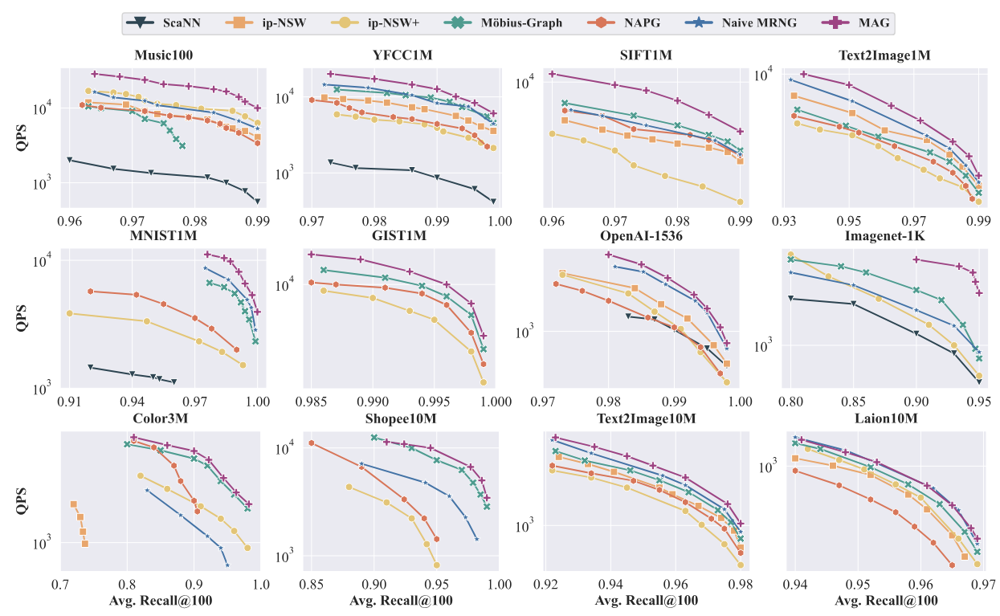

# Metric-Amphibious Graph (MAG)

This repository contains the source code for our SIGIR2025 paper: **Stitching Inner Product and Euclidean Metrics for Topology-aware Maximum Inner Product Search**.

## 1 Abstract

Our investigation, grounded in graph-based search, reveals that different indexing and search strategies offer distinct advantages for MIPS, depending on the underlying data topology. Building on these insights, we introduce a novel graph-based index called Metric-Amphibious Graph (MAG) and a corresponding search algorithm, Adaptive Navigation with Metric Switch (ANMS). To facilitate parameter tuning for optimal performance, we identify three statistical indicators that capture essential data topology properties and correlate strongly with parameter tuning. 

## 2 Competitors

* ip-NSW ([Paper](https://proceedings.neurips.cc/paper_files/paper/2018/file/229754d7799160502a143a72f6789927-Paper.pdf))
* ip-NSW+ ([Paper](https://aaai.org/ojs/index.php/AAAI/article/view/5344/5200))
* Möbius-Graph ([Paper](https://proceedings.neurips.cc/paper/2019/file/0fd7e4f42a8b4b4ef33394d35212b13e-Paper.pdf))
* NAPG ([Paper](https://dl.acm.org/doi/abs/10.1145/3447548.3467412)): 
* ScaNN ([Paper](http://proceedings.mlr.press/v119/guo20h/guo20h.pdf)): 
* Naive MRNG: 

## 3 Datasets

| Dataset         | Base   | Dim. | Query   | Modality   | DBI(Euc.) | DBI(Cos.) | CV   |
|-----------------|--------|------|---------|------------|-----------|-----------|------|
| **Music100**    | 1M     | 100  | 10,000  | Audio      | 1.5       | 2.8       | 0.25 |
| **YFCC1M**      | 1M     | 100  | 1,000   | Multi      | 1.51      | 2.9       | 0.07 |
| **SIFT1M**      | 1M     | 128  | 1,000   | Image      | 3.26      | 2.6       | 0.001|
| **Text2Image1M**| 1M     | 200  | 100,000 | Multi      | 2.5       | 3.0       | 0.03 |
| **MNIST1M**     | 1M     | 784  | 10,000  | Image      | 2.7       | 2.8       | 0.18 |
| **GIST1M**      | 1M     | 960  | 1,000   | Image      | 6.28      | 3.2       | 0.27 |
| **OpenAI-1536** | 1M     | 1536 | 1,000   | Text       | 4.1       | 5.3       | 0.0  |
| **Imagenet-1k** | 1.3M   | 1536 | 1,000   | Image      | 1         | 1.4       | 0.36 |
| **Color3M**     | 3M     | 282  | 1,000   | Image      | 2.6       | 2.1       | 0.17 |
| **Shopee10M**   | 10M    | 48   | 1,000   | E-commerce | 2.4       | 2.1       | 0.24 |
| **Text2Image10M**| 10M   | 200  | 100,000 | Multi      | 3.3       | 3.6       | 0.03 |
| **Laion10M**    | 12M    | 512  | 1,000   | Multi      | 4.3       | 3.6       | 0.0  |

## 4 Building Instruction

### Prerequisites

- GCC 4.9+ with OpenMP
- CMake 2.8+
- Boost 1.55+
- Faiss (optional)

### Compile On Linux

```shell
$ mkdir build/ && cd build/
$ cmake ..
$ make -j
```

## 5 Usage

### Code Structure

- **datasets**: datasets
- **include**: Main file
- **benchmark**: Store index and log
- **script**: some scripts to run the experiments
- **test**: test codes

### How to use

#### Step 1. Build kNN Graph

Firstly, we need to prepare a kNN graph.  You can use Faiss and other libs.

#### Step 2. MAG indexing

```shell
./test/test_mag_index DATA_PATH KNNG_PATH L R C INDEX_PATH MODE DIM R_IP M T
```

- `DATA_PATH` is the path of the base data in `bin` format.
- `KNNG_PATH` is the path of the pre-built kNN graph in *Step 1.*.
- `L` inital pool size.
- `R`maximum out-degree.
- `C` candidate pool size.
- `INDEX_PATH` is the path of the generated MAG index.
- `MODE` index.
- `DIM` dimension of dataset.
- `R_IP` max ip_neighbors.
- `T` ip threshold.

#### Step 3. Adaptive Navigation with Metric Switch

```shell
./test/test_mips_search DATA_PATH QUERY_PATH INDEX_PATH searh_L K RESULT_PATH MODE DIM
```

- `DATA_PATH` is the path of the base data in `bin` format.
- `QUERY_PATH` is the path of the query data in `bin` format.
- `INDEX_PATH` is the path of the generated MAG index.
- `search_L` search pool size, the larger the better but slower (must larger than K).
- `K` the result size.
- `MODE` search.
- `DIM` dimension of dataset.

## 6 Performance

#### Evaluation Metric

- QPS


